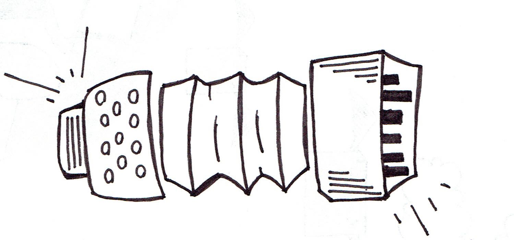
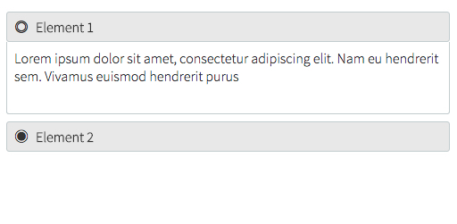

#React Accordion Component



#Installation
```sh
$ npm install react-accordion-component
```
  
#Usage
To get the basic style of the component, link in your `index.html` the CSS file for the Accordion:
```html
<link rel="stylesheet" href=/path/to/accordion.css>
```
(normally located under your `node_modules` directory)
 
 After that just require the component in the desired place of use:
 ```javascript 
 var Accordion = require('react-accordion-component');
 ```
 
 The `Accordion` accepts an array of objects, where each of them may have: 
 + `title`: title for an accordion element (`string`)
 + `onClick`: callback function triggered when an accordion element is clicked (`function`)
 + `content`: content for an accordion element (`string`)

##Example
```javascript
var elements = [];
elements.push({
    title: 'Element 1',
    onClick: function() {
      alert('Hello World!')
    },
    content: 'Lorem Ipsum...'
  });
  
elements.push({
  title: 'Element 2',
  onClick: function() {
  },
  content: 'Lorem Ipsum...'
});
```
When rendering (using `jsx`):
```javascript
React.render(<Accordion elements={elements} />, document.getElementById('accordion-example'));
```
##Voilà

Click in the [fish eye](http://www.fileformat.info/info/unicode/char/25c9/index.htm) to exapand/collapse each accordion element.
 

#Notes
In the `index.html` under `examples/` I've used Source Sans Pro font from Google Fonts. Feel free to change the font in `accordion.css` to your preferred font.

#TODO
+ Add `title` property to the accordion(e.g. `<Accordion elements={elements} title={title} />`
+ Add CSS animations
+ Add API to interact with elements
+ (Dev) Improve gulp file tasks

#License
MIT


